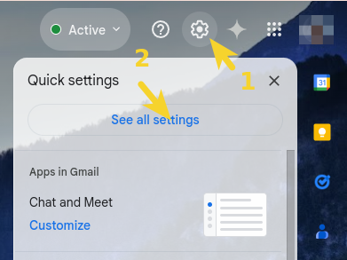
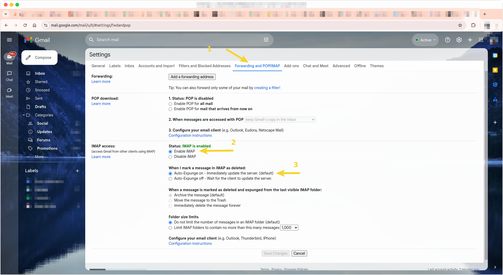
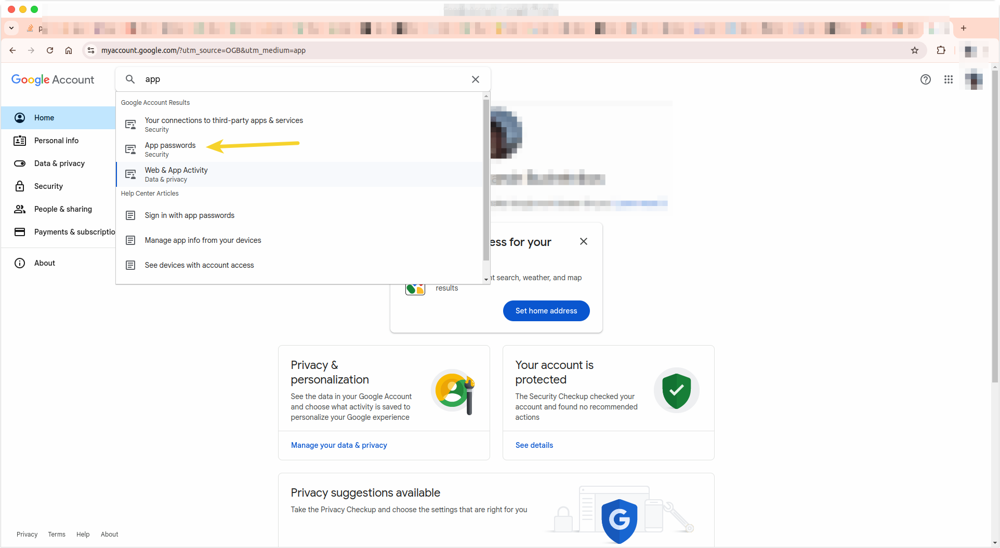

# Serbia Real Estate Bot

## Telegram Bot functions

This telegram bot is used to search for real estate for sale in Serbia.

The service is designed for the telegram channel

[](https://t.me/PokupkaKvartiriSerbii)

*The customer has received permission to publish this bot in the public domain.*

### Project presentation


*View of the pagination page in the telegram bot*


*View of the administrative panel in the browser*

## The technological stack of the project


<details>
<summary>SQLAlchemy + FAST API were also used during the development phase</summary>


</details>

### Where does the real estate data come from

Scripts are run every 24 hours to collect real estate data from the following websites:

- [cityexpert](https://cityexpert.rs/)
- [4zida](https://www.4zida.rs/)
- [halooglasi](https://www.halooglasi.com/)
- [nekretnine](https://www.nekretnine.rs/)

## The structure of the service

The service consists of several microservices:

| №   | Name                     | Link to the documentation                          |
| --- | ----------               | --------------                                     |
| 1   | Nginx                    | -                                                  |
| 2   | Data Base (PostgresQL)   | -                                                  |
| 3   | API                      | [API Readme.md](django_api/README.md)              | 
| 4   | Telegram Bot             | [Bot Readme.md](bot/README.md)                     |
| 5   | Data Scraper             | [Scraper Readme.md](real_estate_scraper/README.md) |

### Useful links when using the service

| №   | Name                  | When running locally (make rebuild) |  When running on the server |
| --- | ----------            | --------------                      | --                          |
| 1   | API documentation      | [http://localhost/swagger/](http://localhost/swagger/)<br>[http://localhost/redoc/](http://localhost/redoc/) | http://{server_ip}/swagger/<br>http://{server_ip}/redoc/ |
| 2   | Admin panel | [http://localhost/admin/](http://localhost/admin/) | http://{server_ip}/admin/ |


## How to run a project locally

1. Open the root directory of the project (it contains Makefile, docker-compose files.yml)
```
touch .env
```
2. Fill in the file.env according to [instructions](#env)
3. In the root directory, run the command
```
make up
```
or
```
sudo docker compose up
```
4. To stop, use Ctrl+C
5. To restart, run the command
```
make rebuild
```
or
```
sudo docker compose stop && sudo docker compose up --build
```

## How to run a project on the server

### Creating variables in GitHub actions

| Secrets                   | Comments | Example  |
| -----------------         | --       | --       |
| `DOCKER_PASSWORD`         | Password for the Docker Hub account |          |
| `DOCKER_USERNAME`         | Username on Docker Hub |          |
| `DOCKER_USERNAME_LOWCASE` | Used in main.yml to access the image in Docker Hub | `tags: ${{ secrets.DOCKER_USERNAME_LOWCASE }}/real_estate_bot_api:latest` |
| `HOST`                    | The IP address of your server, issued by the server provider | |
| `SSH_KEY` | Issued by your server provider |          |
| `SSH_PASSPHRASE`          | Issued by your server provider |          |
| `USER`                    | Name of the user on the server |          |
| `TELEGRAM_TO` | For this step and the step below, you need to create a separate bot that notifies you of a successful deployment. the user ID in the telegram is used to send a message about the successful deployment of the bot to the server. |          |
| `TELEGRAM_TOKEN`          | For this step, you need to create a separate bot that notifies you of a successful deployment. The token from the telegram bot notifying you about the status of the deposit is issued by Bot Father after the bot is created in the Telegram |          |

>[!NOTE]
> If you do not need a notification about the deployment in the telegram bot, comment out or delete the lines below the send_message line, inclusive in .github/workflows/main.yml.
> You also don't have to create the TELEGRAM_TO and TELEGRAM_TOKEN variables in GitHub Actions

### Filling in .env file
<a id="env"></a>

You need to create an .env file and place it in the root directory of the project on your server.
The file must contain the following variables:

```
POSTGRES_USER=estate_bot
POSTGRES_PASSWORD=password
POSTGRES_DB=serbia_re_bot
DB_HOST=db
DB_PORT=5432
API_BASE_URL=http://api:8000/api/
BOT_TOKEN=${token from the telegram bot where the service will operate}

SECRET_KEY='django-insecure-%@@(wjux^bd4x&wobod$cfbfdzh1))_3wxw*^sz(fjh52zdzwh'
ALLOWED_HOSTS=${your server's IP address},127.0.0.1,localhost,api

# variables to access the admin panel, replace them with your own
DJANGO_SUPERUSER_PASSWORD=abracadabra
DJANGO_SUPERUSER_USERNAME=admin
DJANGO_SUPERUSER_EMAIL=admin@admin.com

# optional
# variables for connecting the email backend (it may be useful in the future if users have the opportunity to register by mail)
EMAIL_HOST_USER = '@gmail.com ' # password from the email address, an email will be sent to this address to restore the password in case it is lost
EMAIL_HOST_PASSWORD = ${App password from gmail} # For instructions on how to get a password, see below.
```

#### Setting up a GMAIL account (Configuring SMTP Server)

To restore the password, users will need to receive an email with a link to restore the password in case of loss of the password. This email will arrive at the address that you specify in the EMAIL_HOST_USER environment variable.
Follow the instructions below to set up your gmail account to work with the app.

1. Create an email address on behalf of which you will receive messages for password recovery. (use this email for the EMAIL_HOST_USER variable)
2. Enable two-factor authentication. 
3. Click on the button in the form of a wheel ("Settings") in the upper right corner.
4. Click "See all settings".

5. Go to the "Forwarding and IMAP/POP" tab and set the active items as in the screenshot:

6. Next, create an App password
7. Log into your Google account (make sure that you have enabled two-factor authentication, please note that this can be done not only by phone number, but also, for example, using the Authenticator application. This is relevant if you only have one phone number and it is already in use on another account.)
8. Go to the App password page (instructions in the screenshot).

9. A pop-up window will appear in front of you, enter the name of the password and it will be created automatically, save this password. Paste it into the file.env opposite EMAIL_HOST_PASSWORD=.
10. That's it, now the email backend is set up and ready to work.

*If you want to use another SMTP Server, for example yandex, you need to change the value of the EMAIL_HOST and EMAIL_PORT variables in django_api/django_api/settings.py and set up a yandex account, for example, [according to this instruction] (https://proghunter.ru/articles/setting-up-the-smtp-mail-service-for-yandex-in-django ).*

### Deployment

After cloning the repository to your computer.

1. **Go to the file .github/workflows/main.yml**

2. **Comment out all the lines (they are responsible for publishing the project to the combat server):**
```
> Highlight the lines
> ctrl + /
```
> [!NOTE]
> It makes sense to do this only after adding environment variables (Git Hub Actions) to your repository.

3. **Make sure that there is only the main branch in your repository or you are in the main branch:**

```
git branch

>> main
```
4. **Next, run the following commands:**

```
git add .

git commit -m 'Enabling the deployment instruction in main.yml'

git push
```

> [!NOTE]
> After that, in your repository in the Actions tab, you will be able to observe the process of creating Docker images, creating and launching containers, and upon successful completion of all steps, you will receive a notification in a telegram in a separate bot about the successful deployment.

## Developers

[](https://github.com/AVanslov)
